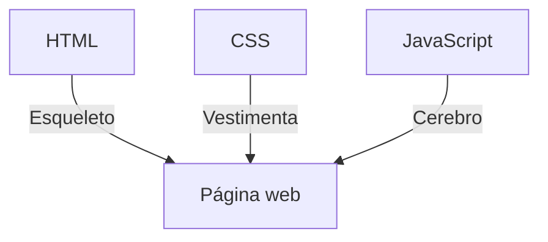
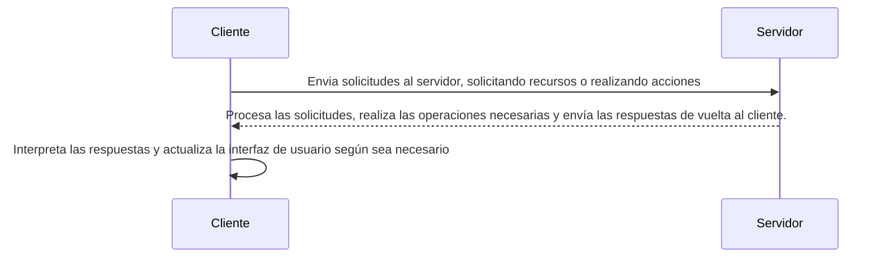

> Modulo 2.- Conocimientos Iniciales

# ¿QUÉ ES SER UN DESARROLLADOR FRONT-END?

### ¿Qué es un maquetador web?

Es aquel que hace la estructura y la visual de una página web. Necesita de dos tecnologias para ello: HTML (HyperText Markup Language) y CSS (Cascading Style Sheet)

### ¿Qué es ser un desarrollador Front-End?

Es aquel que hace la interfaz de usuario (UI).
Esta interfaz de usuario va a ser una página web que va a funcionar como cliente, la cual va a interactuar con el usuario y la lógica del negocio. Esta misma hará uso de una tecnologia llamada JavaScript, para interactuar de esta forma.

### ¿Qué es la Interfaz de Usuario y Cliente?

El usuario es la persona que utilice la página web.
La interfaz de usuario va a ser la página web que va a interactuar como cliente, el cual pide toda la información a un servidor para que la página funcione.

# MAQUETADOR VS DESARROLLADOR

### Maquetador web

Un maquetador web es un profesional encargado de la creación y diseño de la interfaz visual de un sitio web.

### Desarrollador Front-End

Además del diseño implementa la funcionalidad interactiva utilizando JavaScript y colabora en la integración de la interfaz de usuario con el backend.

### ¿Qué es la Interfaz de Usuario?

Es todo lo que permite la interacción entre una persona y un dispositivo, aplicación o programa (botones, menús, iconos, etc)

### ¿De qué se encarga un desarrollador Front-End?

* Interfaz de Usuario (UI): Diseñar y crear la parte visual de una aplicación web.
* Lenguajes de Marcado y Estilos: Trabajar con HTML para la estructura y CSS para el estilo.
* Programación del Lado del Cliente: Utilizar JavaScript y frameworks para la lógica y la interactividad en el navegador.
* Colaboración: Trabajar en estrecha colaboración con los desarrolladores backend y diseñadores para lograr una experiencia de usuario fluida.

# ARQUITECTURA CLIENTE-SERVIDOR

### Cliente

En el desarrollo web, el término "cliente" se refiere a la parte de la arquitectura cliente-servidor que interactúa directamente con los usuarios. Es la interfaz de usuario y las funcionalidades que se ejecutan en el navegador web o en el dispositivo del usuario.

* UI: Es la parte visual con la que los usuarios interactúan en el navegador web.
* Procesamiento del Lado del Cliente: Utiliza HTML, CSS y JS para mostrar información y gestionar la interactividad en el navegador.
* Interactividad: Permite a los usuarios realizar acciones como hacer click, completar formularios y desplazarse por la página.
* Almacenamiento Local: Puede almacenar datos en el dispositivo del usuario mediante cookies o almacenamiento web local.
* Renderización: Se encarga de cómo se presenta la información en el navegador, permitiendo actualizaciones dinámicas sin recargar la página completa.

> El cliente es la aplicación que se utiliza para acceder y visualizar contenido en la web. Los navegadores web como Chrome son ejemplos comunes de clientes web.

### Servidor

En el contexto del desarrollo web, el término "servidor" se refiere a la parte de la arquitectura cliente-servidor que proporciona recursos, servicios y procesamiento de datos.

* Lógica de Aplicación: Ejecuta la lógica de negocio y procesa datos.
* Base de Datos: Almacena y gestiona datos de la aplicación.
* Procesamiento del Lado del Servidor: Realiza operaciones que no se deben hacer en el navegador del usuario.
* Gestión de Solicitudes: Recibe y procesa solicitudes del cliente.
* Seguridad: Implementa medidas de seguridad para proteger datos y operaciones.

> El servidor es la máquina o el software que almacena y gestiona los recursos que el cliente solicita.

**¿La página web es un cliente?**
*No exactamente*. Una página web es más como un medio a través del cual un cliente (ya sea una persona o un programa) puede interactuar con un servidor. La página web es si misma es más como la interfaz de usuario, mientras que el cliente sería el navegador web.

**¿Sería más correcto decir que el navegador o la computadora es el cliente?**
Ambos términos son validos dependiendo del contexto. La "computadora" puede referirse al dispositivo en su conjunto, mientras que el "navegador" es una aplicación especifica en esa computadora que actúa como el cliente al solicitar y recibir información del servidor web.

**¿El servidor es el hosting?**
*No exactamente*, pero la relación entre ellos es cercana. El hoisting se refiere al servicio que proporciona el espacio en un servidor para almacenar los archivos y datos de un sitio web, haciendolo accesible a través de internet. El servidor, en este contexto, es la máquina fisica o virtual que aloja esos archivos y datos.

### Arquitectura Cliente-Servidor

La arquitectura cliente-servidor es fundamental en el desarrollo web. Básicamente, es un modelo en el que las tareas y responsabilidades están divididas entre dos partes: el cliente y el servidor.

###### Comunicación

Protocolos: La comunicación entre el cliente y el servidor se realiza a través de protocolos estandar, como HTTP o WebSocket.

* HTTP: Comúnmente utilizado para solicitar y enviar recursos.
* WebSocket: Permite una comunicación bidireccional en tiempo real.

###### Flujo de Trabajo

###### Ventajas

* Escalabilidad: Permite escalar vertical u horizontalmentee para manejar diferentes niveles de carga.
* Mantenimiento: Facilita la actualización y el mantenimiento, ya que los cambios en el servidor no afectan directamente al cliente.

###### Desafio

* Seguridad: Se debe prestar atención a la seguridad, ya que puede ser vulnerable a ataques.
* Coordinación: La sincronización entre el cliente y el servidor puede ser un desafio especialmente en aplicaciones en tiempo real.

# INTERNET Y WEB

### Internet

Internet es la red global de redes de computadoras que se contectan entre si. Es la infrastructura subyacente que permite la comunicación y transferencia de datos entre dispositivos en todo el mundo. En pocas palabras, es la red fisica de cables, routers, servidores y otros dispositivos que posibilita la conectividad global.

### Web

La web, por otro lado, es un servicio especifico que opera en internet. Es un sisteman de información que utiliza hipervinculos para permitir la navegación entre diferentes documentos, imágenes, videos y otros recursos multimedia. La web es solo una de las muchas aplicaciones que existen en internet, que tambien incluye servicios como el correo electronico, la transmisión de datos, la mensajeria instantanea, entre otros.

> ¡Es como tener un sistema de carreteras (internet) y utilizar un coche para viajar por ellas (web)!

### ¿Qué es una página web?

Las páginas web son documentos electronicos que forman parte de la World Wide Web (WWW) en internet. Estan compuestas principalment por el contenido textual, pero tambien pueden incluir imagenes, videos, enlaces y otros elementos multimedia. Las páginas web se pueden acceder y visualizar mediante un navegador web, como Chrome, Firefox o Safari.

* Definición: Documentos electrónicos en la World Wide Web.
* Identificación: Cada página tiene una URL única (Uniform Resource Locator)
* Lenguaje de Marcado: Escritas en lenguajes como HTML (HyperText Markup Language)
* Composición: Texto, imágenes, videos, enlaces, y otros elementos multimedia.
* Propósito: Pueden ser informativas, blogs, tiendas en linea, redes sociales, etc.
* Interactividad: Algunas ofrecen servicios en linea y funciones interactivas.

---

> Modulo 3.- Herramientas

# WIREFRAME, DISEÑO Y PROTOTIPO

### Wireframe

El wireframe es como el esqueleto, una representacion visual basica de la estructura y disposición de un diseño. Es simple, sin detalles gráficos, y se centra en las disposición de los elementos.

* Estructura Visual: Representa la disposición y distribución de elementos en un diseño.
* Sin Detalle de Gráficos: Se centra en la disposición y relación entre los elementos, sin preocuparse por colores o imágenes.
* Esqueleto del Diseño: Es la base sobre la cual se construye el diseño final, proporcionando una guia visual para el desarrollo.
* Enfoque en Funcionalidad: Destaca la funcionalidad y la interacción más que la apaciencia visual.
* Facilita la Planificación: Ayuda a planificar la arquitectura y la navegación del sitio o aplicación.

### Diseño

El diseño es el paso siguiente, donde se añaden colores, tipografias y elementos gráficos. Aqui es donde la visión cobra vida y se define el estilo visual. Es como la piel del proyecto.

* Estilo Visual: Agrega colores, tipográfias, imágenes y otros elementos gráficos al esqueleto proporcionado por el wireframe.
* Detalles Gráficos: Se centra en la estética y la apariencia visual del producto.
* Identidad Visual: Define la identidad de marca a través de elementos visuales especificos.
* Interfaz de Usuario: Crea una experiencia visual atractiva y coherente para los usuarios.
* Paso Intermedio: Sigue al wireframe y precede al prototipo, dando forma visual al concepto del proyecto.

### Prototipo

El prototipo es una representación interactiva del diseño final. Puede hacer click en los botones, navegar entre páginas y obtener una experiencia más realista del producto final.

* Interactividad: Ofrece una representación más avanzada y funcional del diseño, permitiendo clicks y navegación.
* Experiencia Realista: Proporciona una vista previa práctica y cercana a la experiencia final del usuario.
* Pruebas de Usuario: Facilita pruebas y retroalimentación más realistas antes del desarrollo completo.
* Funcionalidad Completa: Permite probar la funcionalidad del diseño, incluyendo transiciones y comportamientos interactivos.
* Puente entre Diseño y Desarrollo: Sirve como un puente crucial entre la fase de diseño y el desarrollo completo del producto.

> En resumen, wireframe es estructura, diseño es estilo y prototipo es interactividad.

### Herramientas

* Miro: Es excelente para la creación de wireframes y colaboración en tiempo real. Facilita la visualización de la estructura y disposición de elementos siendo ideal para la planificación y conceptualización.
* Figma: Puedes utilizar Figma tanto para el diseño como para prototipos. Es una plataforma integral que permite crear diseños visuales detallados y luego convertirlos en prototipos interactivos. Además, su capacidad de colaboración en tiempo real es muy útil para equipos de diseño y desarrollo.
